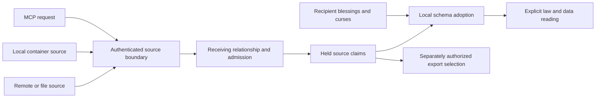

# 60 — Container receiving and local law adoption

Working design, T280. **Full integration is not implemented.** Myk authorized
autonomous implementation of the bounded pure live projection proof (T281) on
2026-09-05 and delegated routine choices; unresolved export/alias policies do not
block that proof. Existing production wiring and frozen rails remain unchanged.
Baseline: `origin/main` at `62ee3e9`, 2026-09-05. This reserves section 60;
`spec/` remains the record of shipped behavior. PR #557 remains separate.

Implementation checkpoint: T281 at `7a0bfc2` proves internal LIVE projection without
receiver signing. Sixteen focused tests and the full isolated repository check pass;
the latter passed 3,184 tests with five existing skips. Independent review accepted
the repaired proof; sampled mutation and ADLC P3/P4 checks pass. This is not
production integration or full P5/P6 certification. T282 at `ee183a4` extends the
same projection to exact one-time selections and live pauses. Its 44 focused tests
and full isolated check pass (3,212 tests, five skips). Six semantic mutations fail
the assertions. Generated mutation sampling kills 19/20; the survivor is independently
verified equivalent, so the strict mutation gate is not claimed as passed.

## The people and the acts

1. Myk creates `media_log` with movie/book schemas and records. He attaches it to
   `alice_outbox`. The receiving container can interpret those records using the
   imported registrations, without granting their author store-wide authority.
2. Myk curses the imported movie reading in `alice_outbox`. Its registration and
   movie deltas remain present. Books still resolve. `media_log` and another
   recipient continue serving their movie readings. Refresh and restart do not
   silently lift the curse. Myk can explicitly lift it.
3. Myk turns automatic blessing off. New data may arrive, but newly offered law
   does not bind automatically. Disabling automatic blessing does not itself
   withdraw existing adopted law; incoming lawful source retractions still affect
   live law. Turning it back on considers held law as well as new arrivals.
4. A connection sends claims or proposes a registration through MCP. Its standing
   and target are checked before the common receiving machinery runs. The same
   admission, attribution and adoption decisions are explainable at that target.
   Sending through MCP never becomes permission to alter the receiving policy.
5. Alice accepts Myk's offered outbox into her own receiving container. She gets
   enough data and schema dependencies to interpret the intended media log, under
   her own local adoption policy. Myk's blessing is provenance, not Alice's consent.
   This story exposes a necessary export contract; receiving alone cannot deliver it.

## Decision ledger

**User-decided intent:** container-local import of data and registrations; local
curse without deleting their deltas; generalize federation controls across local
container interactions and MCP ingress; investigate send controls without pretending
their full shape is settled. Autonomous investigation and design are authorized.

**Not approved:** T279's grant-union retirement, changes to frozen tests, automatic
execution of foreign code, unrestricted onward sharing, or a runtime migration.

**Working choices under delegated authority:** scope a curse to an import
relationship and served reading across versions. Keep independent adoption of held
bytes available while transport is paused. Require an explicit onward-export
selection for the outbox story. These choices do not authorize unrestricted sharing.
Existing channels retain their current behavior during extraction.

**Decided by Myk, 2026-09-05:** adopted law always applies to all deltas within its
relevant scope. In a receiving container, provenance does not restrict a schema to
its source's claims: local records and records from other admitted sources are
eligible too. The receiving context still defines scope, trust and suppression;
the schema's own selection still determines which eligible claims contribute.
This replaces the proposed source-versus-destination interpretation toggle.
Today's source-pool-scoped channel behavior is a migration difference to address,
not a permanent exception to the chosen rule.

**Also decided by Myk, 2026-09-05:** a live container binding follows schema revisions
automatically; a one-time import does not. Bindings and the decisions governing them
are deltas. Effective state must be rederivable from the deltas available to the
reading, including those binding records, rather than remembered by a running process.
This supersedes the earlier recommendation of manual replacement for every revision.

**Further clarified by Myk, 2026-09-05:** source retractions are deltas and flow
downstream over a live connection. Their effect follows ordinary lawful suppression
and source resolution, not a separate recipient withdrawal approval. A lawful
retraction of a retraction likewise participates in the same computation.

## What the repository actually does

Paths and symbols below are authoritative over older ticket line numbers.

| Boundary | Current implementation | Existing evidence / implication |
| --- | --- | --- |
| Verified replication | `src/gateway/ingest.ts`, `federateImpl` | `test/federation/federate.test.ts`, `trust.test.ts`, `pull-completeness.test.ts`; verified union plus admission, not governed append |
| Governed local writes | `ingest.ts`, `appendImpl`; `src/gateway/mutate.ts` | Existing write capability/budget checks; a batch cannot mint its own standing |
| Transport adapters | `src/federation/channel.ts`, `ChannelSource`, `sourceFor` | `source-persisted.test.ts`; pull abstraction already exists, URL/file adapters do not implement local sharing |
| Receiving lifecycle | `channel.ts`, `syncChannel`, `bindArrived`, `attestArrival` | `freeze-toggle.test.ts`, `bless-toggle.test.ts`, `arrival-attestations.test.ts`, `crash-window.test.ts` |
| Local physical attachment | `src/gateway/container.ts`, `openSeparate`, `containerScope` | `attachedContainers` and seeding are physical lifecycle machinery, not a general receive contract |
| Local share-into | T265 / working section 58 | Planned, not shipped; no existing complete local-media-log story to preserve |
| MCP registration | `src/server/http.ts`, `registerStanding`, `registrationSink`, registration handler | `test/server/derived-standing.test.ts`; bound law publishes into inbox using operator signing today, an explicit T274 migration concern |
| MCP receive controls | `http.ts`, federate/container tools | `test/server/federate-mcp.test.ts`, `subtree-receive.test.ts`; controls have scoped authorization, destructive acts have separate staging |
| Root vs bound law | `src/gateway/lifecycle.ts`, `storeBindings`, `boundBindingsImpl` | `test/gateway/bound-fold.test.ts`; bound-opened channels excluded from root, first-claim order independent of attachment order |
| Curse | `channel.ts`, `curseChannelLawImpl`, `cursesOf` | `curse-durable.test.ts`, `curse-by-lens.test.ts`, `curse-authority.test.ts`; receiver-authorized record plus binding strikes, no byte erasure |
| Code execution | `channel.ts`, `blessChannelAppImpl`, `blessChannelResolversImpl` | `install-by-federation*.test.ts`; auto-bless adopts schemas with resolvers withheld, never automatically executes code |
| Outgoing data | `ingest.ts`, `offeredDeltasImpl`; HTTP `/federate`; offer export | Root reactor snapshot, not union of attached pools; T264 container offer is still planned |

Measured baseline: `npx vitest run test/federation test/gateway/bound-fold.test.ts
test/server/federate-mcp.test.ts test/server/subtree-receive.test.ts`:
**41 files, 268 tests passed**. Log: `/tmp/loam-receive-design-baseline.log`.
This proves existing behavior, not the proposed stories. No runtime edits precede it.

### Findings that invalidate a simple adapter-only solution

- `bindArrived` skips registrations whose author equals the receiving operator to
  avoid adopting its own blessings again. Same-store containers normally share that
  operator, so a local source's original registrations would be skipped too. Signer
  inequality cannot stand in for source identity or adoption provenance.
- `federateImpl` relies on operator-rooted constitutional readers to keep foreign
  law inert; its header explicitly assumes distinct operators across instances.
  Same-author imports need explicit law selection. Copying local bytes into a pool
  is not by itself an authority barrier.
- Curse acts on channel-owned pools and has root compatibility handling. Calling
  it on shared source storage could withdraw the source's own authority. A receiver
  must own its adoption overlay independently of the source's law.
- `receiving=false` short-circuits channel sync before reconsideration of held law.
  Container receive leeway can also suspend law visibility. Transport pause, ability
  to receive, and local authority withdrawal are three different decisions.
- Current offer code does not compose attached pool law/data into exports. Planned
  T264 explicitly excludes channel-pool imports unless promoted. Automatically
  re-exporting imported law would change that contract, not complete a missing loop.
- T235 records a curse-lift lawful-survival concern; T224 records peer/receiver
  schema-entity collisions; T214 records root-seeding contamination in channel
  pools. Their ticket descriptions require current-code reproduction before fixes.
  None should be copied into a new abstraction as a normative rule.

## Alternatives

| Shape | Benefits | Why choose or reject |
| --- | --- | --- |
| Make everything an existing channel | Reuses controls, persistence, custody and tests | Reject as final shape: assumes separate owned pool, author inequality, global prefix, operator blessing and destructive drop semantics |
| A receiving relationship with shared policy and explicit target context | Reuses proven primitives; adapters retain authentication and storage differences; adoption belongs to recipient | Recommend: smallest semantic boundary that expresses the stories and makes the mismatches explicit |
| Replace Gateway with a universal graph/engine now | Can express arbitrary sources and law selection together | Defer: combines T274, storage redesign, subscriptions, federation and migration in one unverifiable rewrite |

No new external package or repository. Incubate inside Loam. A future Rhizomatic
standard needs independently proven semantics and conformance vectors; this design
does not earn that name by defining an interface.

## Recommended contract

A **receiving relationship** identifies source, destination and the authority that
permits that relationship. A transport delivers candidates; the relationship decides
how those candidates become held claims and effective local law. Names below are
conceptual, not frozen TypeScript signatures.

The diagram shares policy responsibilities, not authorization rules: a governed
write still requires author standing and a replication request still uses the
replication admission contract. Export does not inherit authority from adoption.

It carries:

- Stable relationship identity, explicit source identity and destination ground.
- Authenticated requesting actor, original delta authors, actual signer of local
  decisions, and authority to act on this destination. These are separate values.
- Admission/trust context, naming policy and law evaluation scope.
- Receiving schedule/state, automatic schema adoption policy and durable local curses.
- A source adapter and storage ownership/lifecycle information, including restart
  reconstruction. Secrets remain outside claim records.

The operation is not a public bypass named `receive` that accepts arbitrary raw
handles. A named boundary constructs a validated context. Governed MCP writes keep
their append standing and whole-batch checks; verified replication keeps its distinct
union semantics. Both then use the relevant shared persistence/adoption machinery.
Unknown operation kinds or missing context refuse; none falls back to primary.

### Claims, adoption, and explanation

Imported claims retain their original signatures and IDs. A local adoption decision
records the receiver's authority to bind particular source law under a local name.
It references original registration/law identity and relationship provenance; it does
not re-sign the original claim as if the receiver authored it.

The effective registration projection reads an explicit selected law set. It must
not infer authority from shared operator identity, physical presence, transport, or
an adoption made in another receiving container. Initial adapters may retain legacy
operator-authored adoption records behind explicit compatibility boundaries, with
new selection preventing shared-author authority leakage; T274 owns broad signing
and public API migration. This compatibility does not permit claiming the new
attribution story complete before the appropriate adapter is migrated.

Isolating only registrations is insufficient. Before same-operator source bytes
enter a new local receiver, **every constitutional consumer** must read only
recipient-authorized inputs: grants, trust, container declarations, exposure,
erasure/slating and registration included. Keep held incoming claims outside the
ordinary administrative reactor and supply selected inputs to evaluators. Physical
co-location is permissible only after the reader boundary proves the same separation.
A raw Gateway reactor containing both sets is not a valid new local-import adapter.
Slice C cannot admit same-author input until this T274-aligned prerequisite exists.

The next input-construction slice must also isolate restart. `Gateway.open` replays
all backend deltas into its administrative reactor, restores registrations and
preloads resolvers. Opening a held-source backend as an ordinary Gateway is therefore
not an inert read operation. Use explicitly identified read-only held snapshots;
keep recipient administration separate before boot replay as well as after ingress.
Preserve existing root administrative inheritance and existing global erasure
obligations. This work does not authorize a new purge surface or imported source
tombstones gaining destination removal authority through shared signer identity.

Reuse `boundBindingsImpl`/`trialBind` for selected declarative law and the existing
scoped gather operand for destination data. Do not label a receiving candidate with
`Bound.channel` merely to record its origin: that field currently changes its data
operand. The negative integration rails must exercise actual append, admission,
public exposure and reading results, including restart, not just inspect filtered IDs.

Reports distinguish received/duplicate/refused claims, adopted/parked/cursed law,
withheld code and unresolved dependencies. An accepted registration is not reported
as serving until its intended reading binds in the intended scope. Provenance must
distinguish source authorship, each forwarding hop and each local adoption decision.

### Auto-bless and curse

Automatic blessing applies only to declarative schema law allowed by the receiving
policy. Resolvers, renderers, grants, trust declarations, membership administration,
erasure commands and other constitutional records do not acquire operational power
merely by arriving. A generic "law" toggle cannot merge those capability classes.

Initial curse key: `(receiving relationship, local served reading)`, maintained
across refreshed versions under that name. It is not a content-global ban. Cursing
one sibling reading does not curse another reading over the same hyperschema.
Already-issued same-name alternate provenance must be resolved explicitly; a UI must
not say a name is gone while another eligible adoption still serves that name.

Curse is a durable receiver-local refusal of automatic re-adoption plus withdrawal
of that relationship's active adoption. Original bytes remain. Lifting is an explicit
authorized decision, with lawful negation closure; a stranger's strike cannot lift it.
Source deletion, relationship recreation, alias changes and new law identities must
not silently claim to be a lift. Exact recreation/alias policy is a named open decision.
Preemptive deny and source-wide curse are optional future operations, not existing
curse semantics disguised as a refactor.

### Data scope and conflicts

Adopted law evaluates over all eligible deltas in its relevant receiving scope,
regardless of arrival source. There is no per-import source-only interpretation
toggle. Scope, trust, exclusions and lawful suppression still constrain that input;
schema selection is not bypassed and ambient primary data is never added. Adoption
still grants imported code no execution rights. Include local-only and other-source
records in the story fixture to prove provenance does not partition interpretation.

An explicitly narrower reading context may define a smaller relevant scope, but
source identity alone cannot silently narrow it. Existing source-pool-scoped channels
stay unchanged only during the mechanics extraction; their convergence needs an
explicit behavioral slice and a coverage-preserving frozen-rail revision proposal.

Receiver-assigned names and deterministic contests remain. Prefix injection and
GraphQL name collisions refuse visibly. Law dependencies include gather-body
`expand.reading` names: importing a top-level registration alone is not closure.
Unresolved/conflicting dependencies park or refuse the import with named diagnostics;
they do not resolve against an unrelated root reading with the same spelling.

Use a relationship-local evaluation registry: embedded original names resolve
within the imported program's source namespace; externally served aliases belong
to the receiver. Two source programs may both reference `Person` without sharing
its resolution. Preserve signed/content-addressed bodies; never silently rewrite
`expand.reading`. A transformed program would be new derived law with its own
identity and provenance, outside the initial slice.

That registry scopes the identity of dependency law, not its data operand. A nested
reading uses the common relevant receiving scope, even when its definition came
from a particular source; resolving the correct definition must not recreate a
hidden source-only data partition.

The private registry resolves only **effective recipient adoptions**, never all
held source registrations. Cursing `Person` must also prevent `Movie` from secretly
using that reading through an embedded expansion. A cursed/missing dependency parks
or refuses the dependent evaluation with a diagnostic; it cannot survive privately
after disappearing from the public surface.

Registry selections are versioned per adoption, not merely per relationship. A
one-time movie adoption carries its exact person-dependency selection; a live movie
reading derives current dependencies without changing that fixed selection. Both evaluate over the relevant
receiving data scope. Receiver-local curses apply to pinned dependencies too.

Binding mode determines revision following. A **live** binding follows the source's
effective schema revisions automatically, under the receiving policy and durable
curses. A **one-time import** records the particular imported selection and retains
it; later source revisions do not change it even if their deltas become available
through another relationship. Updating it requires another explicit import decision.
The mode is recorded as deltas, not an adapter flag. A revision of the selected
source law is distinct from an unrelated claimant contesting its local name:
automatic following never implies silently replacing another source's law.

Automatic blessing pause still prevents new automatic adoptions, including revision
replacement; it does not itself withdraw the already-adopted selection. The retained
selection must be recoverable from decision deltas, never from what happened to be
in a process cache when the toggle changed. On resumption, a live relationship
projects eligible held revisions; a one-time import remains fixed.

Source retractions travel through live bindings like other deltas, including the
lawful forward negation closure. The receiving projection rederives the source's
effective law from the received claims: retracting the newest registration can
reveal an older surviving version under the ordinary resolution rule; retracting
all eligible registrations leaves no source law to adopt. Retracting a retraction
can restore source eligibility. None requires a separate withdrawal permission.

This does not mechanically strike receiver-authored adoption claims with unrelated
IDs. Instead, live adoption eligibility depends on the effective source claims it
references; copying law into an independent local binding must not sever that
dependency. Receiver curses still dominate local adoption, and incoming negations
must themselves be lawful. Pausing auto-bless is not permission to ignore received
source retractions. One-time imports do not follow later source traffic; their
imported selection remains fixed, subject to receiver-local decisions.

### Deltas determine effective state

Relationship identity, source/destination bindings, mode, selected imported law,
local names, adoption/withdrawal decisions and policy changes have durable claim
representations. The one-time selection identifies a closed set or immutable source
revision with resolvable members and dependencies; a process-local list or wall-clock
timestamp alone is not a snapshot. Neither stale handles nor transport events are
independent sources of authority.

For the same available claim closure and explicit reading context, cold replay
must produce the same effective bindings, law, curses, contests and served values
as incremental operation. Permuting arrival order or delivering duplicates cannot
change that answer. Ordering/conflict rules must derive from the claims and the
declared resolution policy, not attachment order, last poll, or last callback.

Caches, indexes and relationship generations are disposable projections of those
claims. They may accelerate or fence execution, but cannot decide lasting state.
Missing required binding/dependency records cause a named incomplete/refused reading,
not invented authority or a primary fallback. Replay never fetches unseen source
updates and calls them already known: live means following the source state available
under the binding, not omniscience about an unreachable source.

Transport secrets remain outside portable deltas. They allow future fetching; they
do not change what already-held claims mean. Reconstructing effective state must not
require a credential, network request, or remembered successful sync.

### Minimal claim and projection contract

The standing live binding is the receiver's authority to follow source law. A new
source revision does not require another receiver signature, adoption-publication
claim, generated strike, or successful sync callback to become effective. Both
incremental evaluation and cold replay use the same pure projection over held
claims and explicit receiving context. Receipts describe effects; they do not
supply a second authorization for an already-authorized live revision.

| Durable decision | Required meaning | Derived rather than separately authorized |
| --- | --- | --- |
| Live relationship | Stable source incarnation/reading lineage, destination, names and permitted law classes under recipient policy | Current effective source revisions and their dependencies |
| One-time import | Exact source registration, program, resolution schema and dependency closure, roots/refs/code policy, resolvable member manifest | Reading that fixed law over current relevant destination data |
| Auto-bless pause | Exact currently selected law/dependency closure, possibly empty, and relationship identity | Eligibility of that selection under received lawful source retractions and local curses |
| Resume, curse, lift, detach, policy changes | Recipient-authorized claims resolved under the established lawful decision rules | Current eligibility and complete effective reading |

A content hash identifies a revision; a stable source incarnation and reading
lineage identify what the binding may follow. Locators and display names are
attributes: a URL change or cosmetic rename need not change identity. An actual
source substitution requires an explicit retarget decision, even if its name or
URL is identical. Retargeting must recheck scope and local curse policy.

A one-time/pause manifest includes the program definition, resolution schema,
registration metadata and exact dependency selections with lawful suppression
closure. A hash without resolvable expected members is incomplete. Neither numeric
`vN` nor a hyperschema entity freezes that closure. Pinning law does not freeze the
receiving data universe: matching new local facts still resolve under that law.

For the bounded T282 proof, the manifest can name the entire verified source
snapshot. Derive selected registration and definition delta IDs from that immutable
operand before adding current retractions. Paused-live eligibility requires those
same IDs to survive; an older definition with identical content is still a different
selection. Do not reload a fallback definition from the augmented operand. The
manifest does not prove that an authenticated source disclosed everything; source
membership and completeness remain an explicit caller boundary.

For an unpaused live binding, derive dependencies from eligible source claims in
their source-relative namespace; evaluate them over the common receiving data
scope. Movie and Person may evolve independently. Different version numbers do not
prove an invalid mixed generation. Require atomic release membership only when
source claims or an exact import/pause explicitly declare such a release.

Incomplete references produce an incomplete reading under deterministic source
resolution, not a fallback to whatever a cache served before. For the initial
contract, an authoritative surviving candidate with a missing required dependency
refuses that reading; older versions are selected only when ordinary lawful source
resolution selects them (for example, after retraction). Every permutation of the
same known claim set must yield the same answer. Incomplete candidates cannot borrow
an unrelated root definition or silently invent a smaller snapshot.

Pause is an explicit selection restriction, not a timestamp cutoff: late backdated
source claims cannot change its selected versions. Received lawful retractions can
make those versions ineligible; pause does not authorize replacing them with another
version. Resume removes that restriction and the live projection follows eligible
held source law without fetching or signing. One-time imports stay pinned and do
not acquire later source traffic merely because it arrived through another edge.

Use established deterministic lawful resolution for receiver decisions, including
current restrictive decisions; do not add a per-revision publication DAG or new
mandatory consensus protocol. When policy is unreadable or genuinely contested,
report that condition without disabling an independently valid curse/revocation.
Historical authorization of a binding/import and its current eligibility are
separate: a later pause must not invalidate the captured selection by demanding
that it cite the new policy, and a later revocation must still constrain its use.

Transport admission still verifies and persists inputs. After asynchronous work,
re-read applicable policy before exposing a derived result. Generation tokens and
caches are projections of decision claims, not extra sources of authority. Cold
replay does not sign/fetch, and a signer-disabled receiver with a valid live binding
must reflect newly available source revisions and retractions directly.

### Existing primitives: reuse and limits

- `Gateway.freeze` selects a delta set, adds forward negation closure, then calls
  `freezeMembers` (`src/gateway/container-identity.ts`). Its order-free content
  address and closure discipline are reusable. `freezeMembers` itself neither
  verifies nor deduplicates input; delivery arrays must become verified sets first.
- `ModuleVersion` is an in-memory `{id, members}`, not a durable member manifest.
  A container's `version` reference alone is not an executable snapshot contract.
  The comparison discipline in `src/gateway/slate.ts` is useful precedent, but its
  deletion authority and lifetime rules are not receiving semantics.
- `readRegistrationVersions` freezes the resolution schema but loads the hyperschema
  definition by its current entity. Pinning that registration ID alone therefore
  does not freeze the entire gather/dependency program. Numeric `vN` aliases may
  shift when earlier bindings are withdrawn. Use exact member/registration IDs.
- `schemaLawAddress` in `adopt-law.ts` is structural identity, not complete binding
  authority: roots, local aliases and adoption context need their own selection
  references. Same structural law does not imply interchangeable authority.
- `syncChannel` currently binds arrived law before arrival attestation. Its custody
  journal recovers debt but does not authorize projected law. Preserve its accounting
  guarantees while keeping receipt recovery separate from effective-law selection.

### Storage, removal, and time

Start new local sharing with an explicit replicated relationship backed by an owned
receiving pool, reusing existing custody/erasure machinery. This is a recommendation,
not a promise that conceptual attachment always copies bytes. Do not implement shared
physical ownership in the first slice. The contract records ownership so a later live
reference adapter cannot accidentally call a pool-purge operation on the source.

Logical removal from a selected reading is distinct from physical erasure. Detach
withdraws the relationship's contribution and leaves its source whole. Existing
remote channel `drop` remains the explicitly destructive owned-pool act; a shared
adapter must refuse it unless it proves ownership of all bytes it will erase.

Persist verified claims and necessary decision/dependency inputs before evaluating
their effects. Receipt persistence/recovery is tracked independently; a receipt-write
failure cannot change the projection of otherwise identical available claims.
An incomplete reading after byte persistence reports that outcome and supports
idempotent recovery; it must not claim a transaction rolled back if bytes remain.
Backend rejection does not prove zero bytes were written. Record/report partial
durable input honestly. After reopen, complete verified claims may participate under
the standing binding; missing required dependencies or decision records still refuse.
Do not invent a hidden success bit that changes the meaning of otherwise identical
held claims. Backend transactional guarantees and custody accounting remain explicit.
Rechecking held law does not require a successful new network fetch. Source scope
narrowing preserves lawful forward negation closure and erasure admission barriers.

Every in-flight receive carries a relationship generation or equivalent freshness
proof. After asynchronous fetch/persistence and before publishing effects, revalidate
destination existence, authority, policy and curses. Detach or revocation cannot be
undone by an older request completing. Persisted bytes may remain with an honest
receipt, but stale work cannot publish newly effective law. The publication decision
is the linearization point; later policy changes invalidate/recompute the active
projection before the next read.

The first implementation may use the existing bounded-by-batch pull adapter. Do not
introduce a second permanent full-world in-memory copy as the new source of truth.
Expose cursored/streaming extension points only when a real adapter uses them.
As-of reads, subscriptions and caches must share the selected law/data context or
refuse unsupported scopes explicitly; no historical root fallback.

### Sending: minimum necessary contract, not a complete policy design

Keep source export authorization separate from receiving adoption. Importing and
blessing alone do not authorize forwarding. For Alice's story, the operator must
explicitly select an exportable closure of data and required schema definitions and
registrations, preserving original authorship. Alice constructs her own adoption.

Recommendation: an outbox may explicitly include the selected imported media-log
closure, rather than requiring re-authorship through promotion. This revises T264's
planned no-re-export rule and requires approval. Automatic transitive forwarding is
not implied. Receiving curses remain local; whether an outbox excludes cursed law
from its offered interpretation is an explicit export selection, not global erasure.
Cycles, duplicate arrivals and repeated forwarding require identity-based deduplication
and traceable provenance, not recursively prefixing/re-blessing our own decisions.

## Acceptance criteria

These are future story rails, **not yet authored or declared frozen**. Every fixture
must prove nonempty source law/data and assert both held bytes and served behavior.

1. Local media import: movie/book records resolve in `alice_outbox` through source
   registrations even with the same operator on both ends; root and unrelated
   sibling remain unchanged. Verify: `test/federation/local-law-import.test.ts`.
2. Scope completeness: matching records from the source, the destination itself,
   and a second admitted source all resolve under the imported schema. A secret
   primary record and an out-of-scope sibling do not; suppressed records stay
   suppressed. Nested readings obey the same input scope while retaining the right
   dependency definitions. Verify: `test/gateway/import-law-scope.test.ts`.
3. Local curse: movie reading disappears after curse, its source bytes remain,
   book and a bystander container still serve; refresh, changed movie law and reboot
   do not revive it; authorized lift restores it. Verify:
   `test/federation/local-law-curse.test.ts`.
4. Authority: a forged curse/lift, source-authored grant, same-operator imported
   trust rule and inbound adoption from another destination confer no local policy
   authority. Include observable admission, exposure, container routing and erasure
   attempts, then reboot; registration names alone cannot prove isolation. Verify:
   `test/gateway/receive-authority.test.ts`.
5. Receiving vs blessing: pause arrival without deleting held content; pause
   automatic adoption without withdrawing current law; explicitly reconsider held
   law without network access. Verify: `test/federation/receive-policy.test.ts`.
6. Code boundary: imported schemas may bind while their resolver/renderer code
   remains inert; only an independently authorized execution act changes that.
   Verify: `test/federation/receive-code-boundary.test.ts`.
7. Dependency/contest behavior: a movie reading depending on a book/person reading
   imports with the right source closure; conflicting names and missing dependencies
   are reported, independent of attachment order, with no root fallback. Use two
   source bodies referencing `Person` plus receiver/root decoys. An uncursed changed
   revision replaces the selected source law automatically for a live binding and
   does not replace a one-time import; unrelated-source name contests remain visible.
   Curse one source's `Person`: its dependent expansion refuses while the other
   source's movie/person readings still serve. Verify:
   `test/gateway/import-law-dependencies.test.ts`.
8. MCP parity: actual HTTP/MCP requests exercise the shared pipeline with the same
   local law outcomes as equivalent local/remote input, while foreign signatures on
   governed append and out-of-scope register attempts remain refused. Verify:
   `test/server/receive-policy-mcp.test.ts`.
9. Replay and failure: a backend writing a subset before rejection is reopened;
   the same verified held claims derive the same effective state as a clean load
   of that subset. Missing actual references refuse; failed receipt accounting is
   reported without pretending durable bytes rolled back or creating new authority.
   source retractions stay effective after selection. Verify:
   `test/federation/receive-recovery.test.ts` and the existing narrowing helper
   `test/gateway/narrowing.ts`.
10. Lifecycle: disconnecting a local import withdraws its contribution but changes
    no source/bystander bytes; destructive drop requires owned storage. Verify:
    `test/federation/local-import-lifecycle.test.ts`.
11. Alice story: two served stores exchange explicitly selected outbox data and law;
    Alice can adopt, curse and lift independently; unrelated imports, authority
    records and credentials are absent from the export. Verify:
    `test/federation/media-log-to-alice.test.ts`.
12. Compatibility: existing channel toggles, curses, scoped MCP controls and root
    behavior retain their measured baseline until a separately authorized policy
    slice changes them. Verify: the baseline command above and `npm run check`.
13. In-flight policy: suspend fetch/persistence; curse, disable automatic blessing,
    detach or revoke authority; resume and assert no stale adoption or relationship
    resurrection, accurate retained-byte receipts, and an unaffected bystander.
    Verify: `test/federation/receive-policy-races.test.ts`.
14. Retractions as input: propagate a lawful source-registration retraction over a
    live binding; latest-version withdrawal reveals the prior surviving version,
    and withdrawal of all candidates leaves none. A lawful strike of that strike
    restores source eligibility while a receiver curse still blocks local adoption.
    A stranger's unlawful strike changes nothing. A one-time import does not follow
    later source traffic. Cold replay derives the same result. Verify:
    `test/federation/import-law-lifetime.test.ts`.
15. Delta-derived binding modes: import the same initial movie schema through one
    live and one one-time relationship, then receive a revised schema. The live
    reading changes automatically and the one-time reading retains its selection;
    curse and blessing pause still bind. Discard caches and replay the same deltas
    in multiple orders with duplicates: modes, selected law, contests and served
    values match the incremental result without network access. A missing required
    selection record refuses visibly. Verify:
    `test/federation/receive-binding-replay.test.ts`.
16. Selection integrity: an authoritative surviving movie reading names a missing
    dependency; it refuses with an incomplete diagnostic, regardless of what served
    before. Supply the actual dependency in either arrival order and derive the
    same reading without signing. Independently versioned complete dependencies
    remain valid unless the claims declare a shared snapshot constraint. Same-name source recreation
    cannot advance the old lineage. Verify:
    `test/federation/receive-selection-integrity.test.ts`.
17. Pause and concurrency: deliver a backdated revision after a recorded pause,
    restart, and prove the exact retained selection survives. Resume without fetching
    and advance only the live binding without a new adoption signature. Existing
    lawful policy resolution is deterministic; a valid curse/revocation remains
    effective despite unrelated policy conflicts. Pause retains its recorded exact
    selection, subject to arriving lawful retractions. Replay signs and fetches
    nothing. Verify:
    `test/federation/receive-decision-replay.test.ts`.

### Concrete replay scenarios for the new rails

Use real signed source/receiver claims and literal expected results. `M1/P1` and
`M2/P2` denote distinct complete movie/person law selections, not mutable aliases.
In the missing-dependency case M2 explicitly requires P2; independent readings are
not otherwise required to advance in lockstep.
Each scenario starts from the same explicitly nonempty fixture: one live and one
one-time adoption of M1/P1, matching records from two sources plus a local record,
and an out-of-scope root decoy. Both adoptions initially resolve all three eligible
records; neither resolves the decoy.

| Sequence after the shared fixture | Required result |
| --- | --- |
| Receive authoritative M2 without its explicitly required P2 | Live reading refuses incomplete dependency; one-time still uses its complete M1/P1 selection |
| Receive P2 and remaining actual references | Live derives M2/P2 without signing; one-time uses M1/P1; source signatures unchanged |
| Add another matching local fact after the one-time import | Both scopes see four eligible facts through their respective law versions; one-time does not freeze all destination data |
| Record pause retaining M1/P1; receive M2/P2 whose timestamps predate pause; cold replay | Paused live and one-time remain M1/P1; wall-clock comparisons cannot select M2 |
| Resume that live binding with all candidate bytes already held | Resume is the policy decision; projection derives M2/P2 without another signature or fetch |
| Curse Person; replay, then lift | Dependent Movie refuses while cursed; lift restores only eligibility of each adoption's own selected dependency version |
| Destroy caches and ingest the identical final claim set in reverse order with duplicates | Same law selections, contests, curses and served records; no signer or network needed |
| Supply the selection hash but omit a declared member or governing decision | Incomplete/refused, never a smaller silently accepted snapshot |
| Receive a lawful strike of the live source's newest registration, then a lawful strike of that strike | Live source resolution falls back, then revives under the same ordinary rules; a local curse prevents effective adoption throughout; one-time selection does not follow later traffic |

A candidate update's incompleteness is not evidence that a source withdrew previously
committed law. Actual received lawful retractions are evidence and must participate
in the projection; incomplete transport and semantic withdrawal are distinct.

## Migration proposal and rail impact

### First implementation contracts, proposed for P2

1. **Pure receiving-policy projection** (`src/gateway/receive-policy.ts`, proposed):
   consume validated relationship/policy claims, source law candidates with provenance,
   exact one-time/pause selections and the explicit receiving scope. Return selected
   effective law, dependency identities, exclusions/curses and named incomplete/contest
   diagnostics. It cannot access a signer, transport, Gateway singleton, primary
   fallback or mutable process history. First vertical proof: a standing live binding
   plus source revision/strike deltas changes its output with no receiver signature.
   Verification: the replay/decision rails in criteria 14–17, new files measured on
   base before declaring rails. This module does not itself ingest same-author claims
   into existing administrative reactors.
2. **Explicit input construction** (T274-aligned boundary over `ingest.ts`,
   `container.ts`, and constitutional readers): separate incoming held claims,
   recipient-administrative inputs, selected schema law and relevant evaluation data.
   Construct that context once; enumerate every consumer that could otherwise read
   operator-signed imported grants/trust/erasure/exposure as local authority. Required
   before wiring the pure projection to a same-store source. Criterion 4 is the gate.
3. **Scoped evaluation adapter** (`lifecycle.ts` and its registry construction):
   evaluate selected law over the destination operand; resolve embedded dependency
   definitions in the correct source namespace, using exact maps only for pinned
   modes. Preserve current external APIs during the first mechanics slice. Criteria
   1, 2 and 7 plus the T200 revision below establish behavior. Importing a schema is
   not a write capability; mutation still chooses an authorized explicit destination.
4. **Ingress and mode adapters** (`channel.ts`, local-container source, `http.ts`):
   persist verified candidates using existing replication or governed-write contracts,
   then invalidate/recompute the shared projection. Binding/import/pause/curse acts
   append their own decision deltas; ordinary live revisions do not. Preserve custody
   debt and failure reporting without making either a law-authority gate. Criteria
   5, 8, 9 and 13 prove adapters reach the common boundary. T265 local share remains
   the product act; no competing sharing API is introduced.

The authorized T281 experiment is contract 1's live-only subset with real signed
fixtures and zero production wiring, followed by contract 2's census/negative cases.
Do not begin by replacing `adoptLaw` globally: its frozen-adoption behavior is still
the correct one-time behavior. Broader export work is not a prerequisite of that
bounded projection proof. These are proposed slices, not created implementation
tickets for full integration or a claim that its P2 DAG gate passed. T281 owns
`src/gateway/receive-policy.ts` and `test/gateway/receive-policy.test.ts`; it refuses
unsupported one-time/pause/dependency shapes rather than claiming all 17 criteria.

### Exact base-rail impact census

Read-only census; line numbers refer to baseline `62ee3e9`. These files were covered
by the focused baselines, including the later 36-case gateway adoption run. No
assertions have been edited. The base-store guard still computes the full frozen set.

| Existing rail and declaring ticket | Actual promise | Proposed treatment |
| --- | --- | --- |
| `test/federation/identical-law-two-peers.test.ts:25`, T200 exact path | Two peers both enter `friends`; their identical readings separately answer heights 11 and 22 at lines 56–57 | Direct conflict: both readings should evaluate the same relevant set. With existing timestamp-pick policy and fixture timestamps 1000/2000, both should answer 22. Exact revision must preserve both names binding, successful reads and honest reports; add an outside-destination 999 decoy and a set-valued proof of both candidates |
| Same file, case at line 65, T200 | Repeated unchanged sync adds no registration narrative | Preserve: pure projection should not mint per-revision or per-poll adoption records |
| `test/federation/scoped-doors.test.ts:57`, T186 exact path | Primary-only 999 is excluded; eligible peer 11 resolves | Preserve unchanged: destination scope still excludes unrelated primary claims |
| Same file, lines 45 and 71, T186 | Unsupported channel subscriptions refuse; root subscriptions still work | Preserve until a separately scoped subscription implementation exists |
| Same file, line 87, T186 | Cross-ground source retraction removes an imported domain fact | Preserve; this does not yet test registration withdrawal |
| `test/federation/fan-in.test.ts:57`, T186 exact path | `friends` byte scope already includes both pools | Preserve; reuse the existing composition rather than invent another union |
| `test/federation/name-parked.test.ts:101`, T186 exact path | A distinct receiver-owned incumbent is not silently replaced | Preserve: this is not a same-source revision and does not prohibit live following |
| `test/federation/bless-toggle.test.ts:29`, T186 exact path | Pause admits bytes but withholds a newly added lens, retaining the old one | Preserve; the case does not assert immunity to later source retractions |
| `test/gateway/adopt-law.test.ts:1508`, T33 exact path | Frozen adoption remains after source definition withdrawal; a new adoption refuses | Preserve as one-time behavior, not a live-binding contradiction; later validated by the 36-case gateway adoption run |
| Same file, line 1217, T33 | A snapshot containing a lawful withdrawal cannot newly bless that withdrawn law | Preserve for both initial one-time and eligible live selection |
| `test/federation/curse-durable.test.ts`, `curse-by-lens.test.ts`, T186 exact paths | Durable local curse, sibling protection and lawful lift | Preserve for all binding modes |

This census found one direct scope assertion requiring revision. It found no rail
asserting that a same-source live revision must park or that source registration
withdrawal must leave live law effective. Those need new positive/negative rails,
not retirement of unrelated incumbent-conflict or frozen-adoption coverage.

No broad rail rewrite. New tests start in new files, run against base to separate
controls from actual red cases. Frozen revisions require the exact base-declared
authorization mechanism in `scripts/rail-renames.json`, with preserved coverage
listed before its declaration lands. No blanket exemption or weakening of CI.

| Slice | Contract delivered | Existing work / rail consequence |
| --- | --- | --- |
| A: reproduce and census | Evidence of all ingress, selection, curse and export callers; reproduce T214/T224/T235 as relevant | No runtime behavior change; freeze no nonexistent tests |
| B: shared policy extraction | Existing remote/file channels call one receiving coordinator with explicit validated context | Existing federation rails unchanged; scopes/types coordinate with T274 |
| B2: decision projection | Standing live bindings, exact one-time/pause selections, pure projection and ordinary lawful policy resolution | New receiving decision rails; no per-revision publication records; no same-author input until C |
| C: isolated inputs and local adoption overlay | All constitutional readers isolated before same-author ingest; source-relative dependency registry; local curse and replay | Prerequisite for T265 sharing; new story rails; settle minimal T274 authority contract first |
| D: local sharing | Explicit relationship, owned pool, source adapter and complete declarative law dependencies | Integrate with T265, not a competing share verb; preserve source/bystander bytes |
| E: MCP integration | Governed append/register retain authorization while consuming shared receiving context | Coordinate T263/T274; T278 code blessing remains separate; no global federation bypass |
| F: outbox/Alice | Explicit onward export and independent remote adoption | Revise T264 planned contract only after decision; scoped export/security rails |
| F2: channel scope convergence | Existing channels apply adopted law across their relevant receiving scope under the decided rule | Enumerate source-pool isolation assertions and preserve out-of-scope/bystander protections in exact proposed rail revisions; no silent change in slice B |
| G: convergence/landing | Contract census closed, remaining wrappers narrowed, documentation matches served behavior | Reassess #557/T279 only with replacement workflow demonstrated; archive only realized tickets |

B depends on A; B2 on B; C on B2 plus the minimal explicit-authority contract; D and E depend
on C and may run independently only if their changed modules are disjoint; F depends
on D plus the approved export contract; F2 depends on C and the approved exact
rail-revision declarations; G follows all accepted slices. Do not wire
T263 -> T274 -> T280 -> T263 as a cycle. Decompose the minimal T274 prerequisite as
its own concrete contract before populating the implementation DAG.

Existing rails to preserve or explicitly review include derived-standing and
bound-fold, federation curse/toggle/authority suites, scoped doors, source persistence,
custody/crash-window, install/code-boundary, and T263 leeway/cascade rails. T279's
bound-key grant-union case is a known prospective revision, not authorized here.
T264/T265 currently propose tests without frozen rails; revising their unbuilt design
still requires an explicit product decision, but is not a frozen-test exemption.

Confirmed base declarations: T263 freezes `test/server/derived-standing.test.ts`
and `test/gateway/bound-fold.test.ts`; archived T186 freezes the blessing/freeze
toggle and durable/by-lens curse suites; T217 freezes
`test/server/federate-mcp.test.ts`. The full base-store glob expansion, including
archived tickets, remains the guard's authority; this sample is not an allowlist.

## Questions to settle after the investigation

1. Settled: law applies to all deltas within its relevant scope, irrespective of
   provenance. No source-only interpretation toggle; see the decision ledger.
2. Revision following is settled: live bindings follow automatically, one-time
   imports retain their selected version, and all effective bindings rederive from
   deltas. Source retractions also flow over live bindings and resolve normally,
   including lawful retraction-of-retraction; local curses remain effective.
3. May an explicitly configured outbox export adopted source law/data without
   re-signing through promotion? Recommendation: yes, for a selected closure; no
   implied forwarding from mere possession or blessing.
4. What should a curse mean across aliases and deleted/recreated relationships?
   Recommendation: retain stable relationship identity on resume; explicit new
   relationship/new alias decisions must disclose any existing relevant curse.

Independent review and unresolved findings belong in
`60-container-receiving-review.md`. Passing spec-lint is not P1 approval. P2 is a
proposal until the decisions, ticket DAG and cold-start checks pass.
