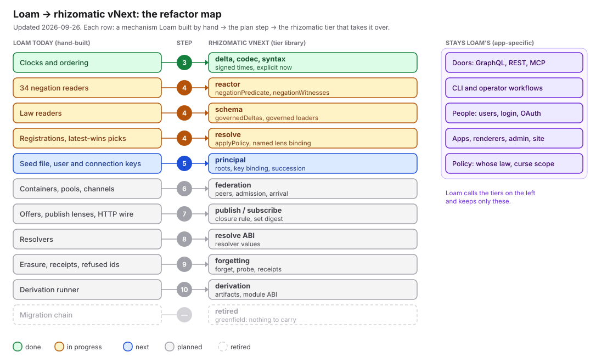

# The refactor map

Updated 2026-09-26. Loam main is on `@bombadil/rhizomatic@0.11.0-next.3`. Rhizomatic step 4 is
merged (rhizomatic #48, #49).

The refactor moves in three directions at once:

- **Extract.** Loam built mechanisms around rhizomatic. Each one that is not app-specific becomes
  a rhizomatic capability.
- **Export.** Rhizomatic becomes a monorepo of tier libraries, with one barrel package over them.
  Sol owns it.
- **Delegate.** Loam calls those tiers and keeps only what is its own: its endpoints, its people, its
  apps and its policy choices. Claude owns it.

This file and its picture are updated in the same PR as every refactor step. The plan is [PLAN.md](PLAN.md). The
rulings are in [README.md](README.md).

## The map

Each row is a mechanism Loam built by hand, the plan step that moves it, and the rhizomatic tier
that takes it over. Green is done, amber is in progress, blue is next, grey is planned. The
migration chain was retired, not moved (greenfield, #596). The purple column is what stays Loam's.

To update the picture, edit `ROWS` or `KEEPS` in `tools/map.mjs`, run
`node refactor/tools/map.mjs`, and commit `map.svg` with the change. Update the tables below in the
same PR.

## Steps

| Step | rhizomatic (Sol) | Loam (Claude) | State |
| --- | --- | --- | --- |
| 1. Graph | package graph, mechanical check (#38) | census ratchet in CI (#572) | done |
| 2. Boundaries | files into tier packages (#38) | recordings harness (#573) | done |
| 3. Time | signed validity, explicit `now` (#43); refresh skip (#44); verified set copies (#46); 0.11.0-next.2 | switch to 0.11 (#585); read time is the wall clock, `stamp()` (#600); unreadable stores refused (#586); next.2 (#604) | done |
| 4. Suppression, governed reads | `negationPredicate`, `negationWitnesses`, `governedDeltas`, `applyPolicy`, `latestByKey`, governed loaders, the lens binding (schema tier) and shared vectors, merged (#48) and published as 0.11.0-next.3 (#49); helper follow-ups in #50 | seams `negatedAt`, `lawfulSnapshot(now)` (#588, #589, #592); history reads split out; timed recordings and reader audit (#587); the swap landed (#606); caches follow validity, one-id readers audited, strike readers count only in-window, the constitution walk reads negations and grants in their window (Myk, 2026-09-26) (#607); `receive-policy.ts` on the governed read, erasure and graveyard reads are history reads, a drop severs for good, `survivalOver` reads at `now`, honest grant labels (#608); fixtures sign with `stamp()` (#609); the store guard fails closed on an expired separate declaration, `pen create` asks the door, latest-wins picks stay Loam's because the tie direction differs (this PR) | done |
| 5. Principal | roots, key binding, succession, delegation | principal recording (#590); revoke fix (#591) | next |
| 6. Peer, admission | peer model, guard pipeline, arrival testimony | curse-scope recording (#597); park reason (#598) | planned |
| 7. Publish, subscribe | federation: per-subscriber lenses, closure audit, set digest | adopt the revised HTTP binding | planned |
| 8. Resolve | resolver value ABI | resolvers move out | planned |
| 9. Erasure | erase, probe, orders, receipts, sealed payloads | erasure moves onto the substrate | planned |
| 10. Derivation | artifact identity, module ABI | derived functions on the new ABI | planned |

## Measures of delegation

The census ratchet counts coupling in Loam's source. A count may only fall.

| Measure | At the start (#572) | Now |
| --- | --- | --- |
| Direct `reactor.snapshot()` references | 48 | 42 |
| Wall-clock reads in core code | 20 | 15 |
| Operator-seed reads | 63 | 63 |
| Files in import cycles | 22 | 22 |
| Largest import cycle | 20 | 20 |

Other results so far:

- About 2,400 lines of migration code were removed (#596).
- A write on a store of 4,000 deltas went from 441 ms to 10 ms (#603, #604, rhizomatic #46).
- The step 4 swap changes 3 seam bodies (`negatedAt`, `lawfulSnapshot`, `lawfulDeltasAt`) and gives `dataStruck` and `honoredStrikeOn` new bodies, instead of editing about 60 call sites.

The import cycle breaks at step 6, when containers become peers. The seed reads fall at step 5,
when keys become signed data.
