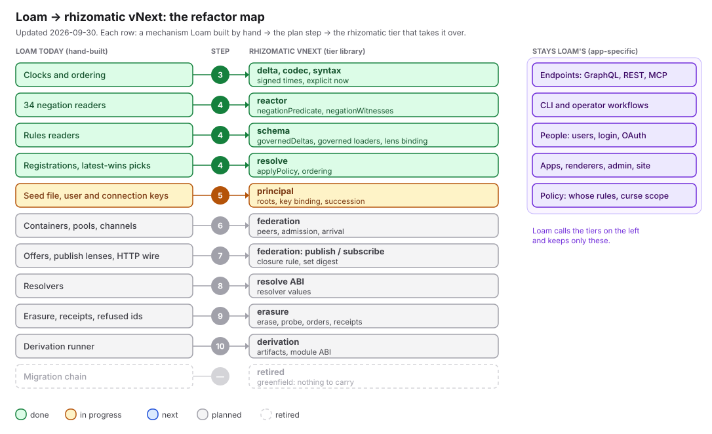

# The refactor map

Updated 2026-09-30. Loam main is on `@bombadil/rhizomatic@0.11.0-next.6`, Sol's step 6 prerelease.
Steps 5 and 6 are done in both repos. In Loam, every host opens and writes through its peer journal
(#667), and every pool is its own peer under its own key (#671); the end-to-end story confirms it
through the CLI. The container split closed step 6 (ruling 13): a gateway is a view of its
container's journal (#676), the census shows 0 import cycles (#677), and container code uses a
child only through `Peer`, in four PRs (#678 to #681). The handoff of existing pools is dropped
(ruling 10). The migration now pauses for the audit.

The refactor moves in three directions at once:

- **Extract.** Loam built mechanisms around rhizomatic. Each one that is not app-specific becomes
  a rhizomatic capability.
- **Export.** Rhizomatic becomes a monorepo of tier libraries, with one barrel package over them.
  Sol owns it.
- **Delegate.** Loam calls those tiers and keeps only what is its own: its endpoints, its people, its
  apps and its policy choices. Claude owns it.

This file and its picture are updated in the same PR as every refactor step. The plan is [PLAN.md](PLAN.md). The
rulings are in [README.md](README.md).

## The map

Each row is a mechanism Loam built by hand, the plan step that moves it, and the rhizomatic tier
that takes it over. Green is done, amber is in progress, blue is next, grey is planned. The
migration chain was retired, not moved (greenfield, #596). The purple column is what stays Loam's.

To update the picture, edit `ROWS` or `KEEPS` in `tools/map.mjs`, run
`node refactor/tools/map.mjs`, and commit `map.svg` with the change. Update the tables below in the
same PR.

## Steps

| Step | rhizomatic (Sol) | Loam (Claude) | State |
| --- | --- | --- | --- |
| 1. Graph | package graph, mechanical check (#38) | census ratchet in CI (#572) | done |
| 2. Boundaries | files into tier packages (#38) | recordings harness (#573) | done |
| 3. Time | signed validity, explicit `now` (#43); refresh skip (#44); verified set copies (#46); 0.11.0-next.2 | switch to 0.11 (#585); read time is the wall clock, `stamp()` (#600); unreadable stores refused (#586); next.2 (#604) | done |
| 4. Suppression, governed reads | `negationPredicate`, `negationWitnesses`, `governedDeltas`, `applyPolicy`, `latestByKey`, governed loaders, the lens binding (schema tier) and shared vectors, merged (#48) and published as 0.11.0-next.3 (#49); helper follow-ups in #50 | seams `negatedAt`, `lawfulSnapshot(now)` (#588, #589, #592); history reads split out; timed recordings and reader audit (#587); the swap landed (#606); caches follow validity, one-id readers audited, strike readers count only in-window, the constitution walk reads negations and grants in their window (Myk, 2026-09-26) (#607); `receive-policy.ts` on the governed read, erasure and graveyard reads are history reads, a drop severs for good, `survivalOver` reads at `now`, honest grant labels (#608); fixtures sign with `stamp()` (#609); the store guard fails closed on an expired separate declaration, `pen create` asks the door, latest-wins picks stay Loam's because the tie direction differs (#610) | done |
| 5. Principal | SPEC-14 evidence records, `authorsForPrincipal`, `associatedKeys`, the `actsFor` predicate, the guarded live resolver; 0.11.0-next.4 (#51, #52); negation and materialization refresh fixes, 0.11.0-next.5 (#54, #55, #56) | principal recording (#590); revoke fix (#591); the seam and the audit (#612); on next.4: a delegate writes only, cannot pass it on, and the root or the operator revokes it (Myk, 2026-09-26) (#615); a connection writes by a sealed delegation scoped to its inbox, the root store honors no delegate (#617); grants name users (#625-#627); `loam user recover` and its readers (#630-#634); memberships name users (#635); identity is per peer (#637); the recovery-history barrier with cut manifests (#639, #640); provisioned containers name their user (#641); an inbox composes into its parent by its owner's authority (#642); an owner's clear reaches her connections' writes (#643); one signer per ground, seed reads 62 → 5 (#644, #645) | done |
| 6. Peer, admission | peer, admission and arrival contract, the ordinary journal with erasure, rebase, degraded open and mixed transfers (#53, merged; published as 0.11.0-next.6); the handoff of existing pools, dropped (ruling 10) | curse-scope recording (#597); park reason (#598); the inventory (#647, #650); the handoff spec (#648); inbox grants with the pool's key (#649); the staging open (#651); the host trial plan and SPEC-6 §3 transfer rule (#656, #657); the recovery barrier across transfers (#658); the pool-keys plan (#659); a pool's own law on its own key (#660); selected host law by context (#661, #662); the carry of an existing pool (#663, reverted by ruling 10); next.6 pinned with the journal store adapters (#666). Rulings 11–13: operations are peer-scoped (a curse is pool-local), received law keeps the peer's start time, and the step ends with the container split. the host on its peer journal, erasure proven at the bytes (#667); every pool its own peer under its own key, host erasures reaching pools as orders naming them, a pool's own strike retiring a selected host copy (#671); the container split note (#669); the end-to-end story (test/refactor/step6-story.test.ts). The pool-local curse (#673); split steps 1 to 3 (#670, #674, #675); a gateway is a view of its container's journal (#676); 0 import cycles. The peer interface (ruling 13, Myk's "B"): the container table in the Store, children as `Peer` handles (#678); a pool signs its own acts (#679); erasure reaches a pool as a delivered order and a probe (#680); the lock, `treeReach` 0 and the peer probe (#681). | done |
| 7. Publish, subscribe | federation: per-subscriber lenses, closure audit, set digest | adopt the revised HTTP binding | planned |
| 8. Resolve | resolver value ABI | resolvers move out | planned |
| 9. Erasure | erase, probe, orders, receipts, sealed payloads | erasure moves onto the substrate | planned |
| 10. Derivation | artifact identity, module ABI | derived functions on the new ABI | planned |

## Measures of delegation

The census ratchet counts coupling in Loam's source. A count may only fall.

| Measure | At the start (#572) | Now |
| --- | --- | --- |
| Direct `reactor.snapshot()` references | 48 | 42 |
| Wall-clock reads in core code | 20 | 15 |
| Operator-seed reads | 63 | 5 |
| Files in import cycles | 22 | 0 |
| Largest import cycle | 20 | 0 |
| Container-code lines that reach the tree as gateways | — | 0 |
| Members one container may use of another (`Peer`) | — | 28 |

Other results so far:

- About 2,400 lines of migration code were removed (#596).
- A write on a store of 4,000 deltas went from 441 ms to 10 ms (#603, #604, rhizomatic #46).
- The step 4 swap changes 3 seam bodies (`negatedAt`, `lawfulSnapshot`, `lawfulDeltasAt`) and gives `dataStruck` and `honoredStrikeOn` new bodies, instead of editing about 60 call sites.

The import cycles fell to 0 at step 6, when the container split moved the pure readers out of the
effect files. The seed reads fell at step 5,
when each ground got its own signer (#644, #645).
